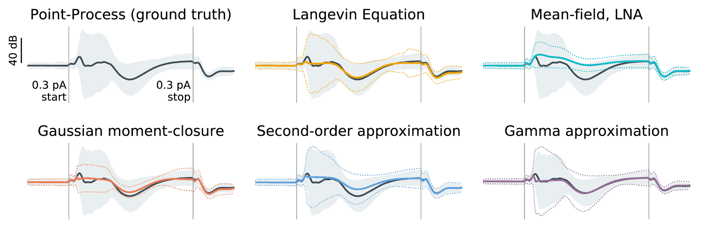
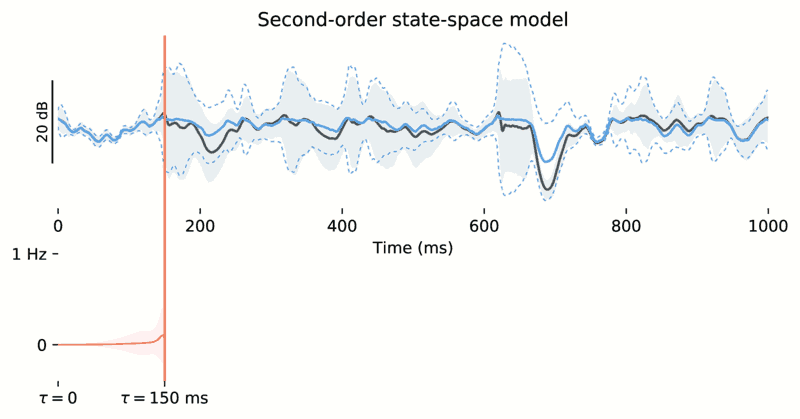

# GLM moment closure

This repository contains a demonstration of moment closure applied to autoregressive point-process generalized linear models (PPGLMs), to accompany the paper ["Autoregressive Point Processes as Latent State-Space Models: A Moment-Closure Approach to Fluctuations and Autocorrelations "](https://www.mitpressjournals.org/doi/abs/10.1162/neco_a_01121). Please see the iPython notebook `ARPPGLM_moment_equations` for further details. 

### Contents

 - `ARPPGLM_moment_equations.ipynb`: primary demonstration notebook to accompany the paper.
 - `ARPPGLM_gamma_moment_closure_v1.ipynb` and `v2`: Unpublished experiments with other moment-matching assumptions that are more accurate on the simulated test data, but with unclear generality
 - `arppglm.py`: Functions for Langevin sampling and moment propagation
 - `izh.py`: Succinct module to simulate Izhikevich neurons
 - `glm.py`: Routines for autoregressive log-linear Poisson generalized linear models
 - `plot.py`: Plotting helpers
 - `utilities.py`: Misc. helper functions
 - `functions.py`: Defines commonly used small functions
 - `arguments.py`: routines for argument checking and verification

### Example figures

  

> ***Caption:*** *Moment closure captures slow timescales in the mean and fast timescales in the variance. Five approaches for approximating the mean (black trace) and variance (shaded, 1σ ) of the log-intensity of the autoregressive PPGLM phasic bursting model, shown here in response to a 150 ms, 0.3 pA current pulse stimulus (vertical black lines). The Langevin equation retains essential slow-timescale features of point process, but moments must be estimated via computationally intensive Monte-Carlo sampling. The mean-field limit with linear noise approximation cannot capture the effects of fluctuations on the mean. Gaussian moment closure captures the influence of second-order statistics on the evolution of the mean, but underestimates the variance owing to incorrectly modeled skewness. A second-order approximation better captures the second moment. An (experimental) moment-closure based on the gamma distribution provides the most accurate recovery of the mean.*

  

> ***Caption:*** *Moment closure methods provide a way to convert between autoregressive and state-space point-process models. The history of the point process is taken as the state space, and moment-closure provides (nonlinear) equations governing the time evolution of the latent distribution over this state-space, approximated as a Gaussian process (red).*

### Regarding `obsolete theano experiments`: 

I've explored using the resulting moment equations for inference directly; At the time I needed to use the now-obsolete theano to improve performance. It is unlikely that any of this code will run, but here are the major unpublished insights: 

 - The moment-closure reduction of the autoregressive model has a relatively large state space, but (for a single cell), one-dimensional observations. It's best to perform the Poisson observation update on this one-dimensional Gaussian marginal, using your favorite approach. I suggest directly integrating to get the posterior moments, since it is only 1D, although variational methods work well too. The update can then be propagated to the rest of the state space using expectation propagation. This is quite fast. 

 - Because the moment-closure reduction is a coarse-graining operation, it's not meaningful to regress the resulting parameters against data directly by e.g. optimizing the variational evidence lower bound or similar. When I attempted this, the model tended to drastically attenuate the variance associated with spiking.

 - In summary, moment-closure on autoregressive models is a nice way to convert an estimated point-process model into a simpler, coarse-grained model which behaves like a mean-field model in the mean, but also captures information about bursting, etc, in its covariance terms. This simplified model is continuous and differentiable, and may be more amenable to mathematical analyses. It can also be used to obtain a second-order neural-field reduction of a population. 

