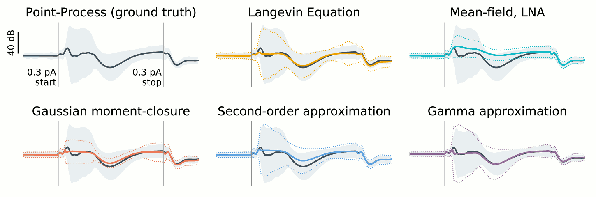

# GLM moment closure
This repository contains a demonstration of moment closure applied to autoregressive point-process generalized linear point-process models (PPGLMs). Please see the iPython notebook `ARPPGLM_moment_equations` for further details. 

*Caption: Moment closure captures slow timescales in the mean and fast timescales in the variance. Five approaches for approximating the mean (black trace) and variance (shaded, 1σ ) of the log-intensity of the autoregressive PPGLM phasic bursting model, shown here in response to a 150 ms, 0.3 pA current pulse stimulus (vertical black lines). The Langevin equation retains essential slow-timescale features of point process, but moments must be estimated via computationally intensive Monte-Carlo sampling. The mean-field limit with linear noise approximation cannot capture the effects of fluctuations on the mean. Gaussian moment closure captures the influence of second-order statistics on the evolution of the mean, but underestimates the variance owing to incorrectly modeled skewness. A second-order approximation better captures the second moment. (E) Example stimulus. An (experimental) moment-closure based on the gamma distribution provides the most accurate recovery of the mean.*
